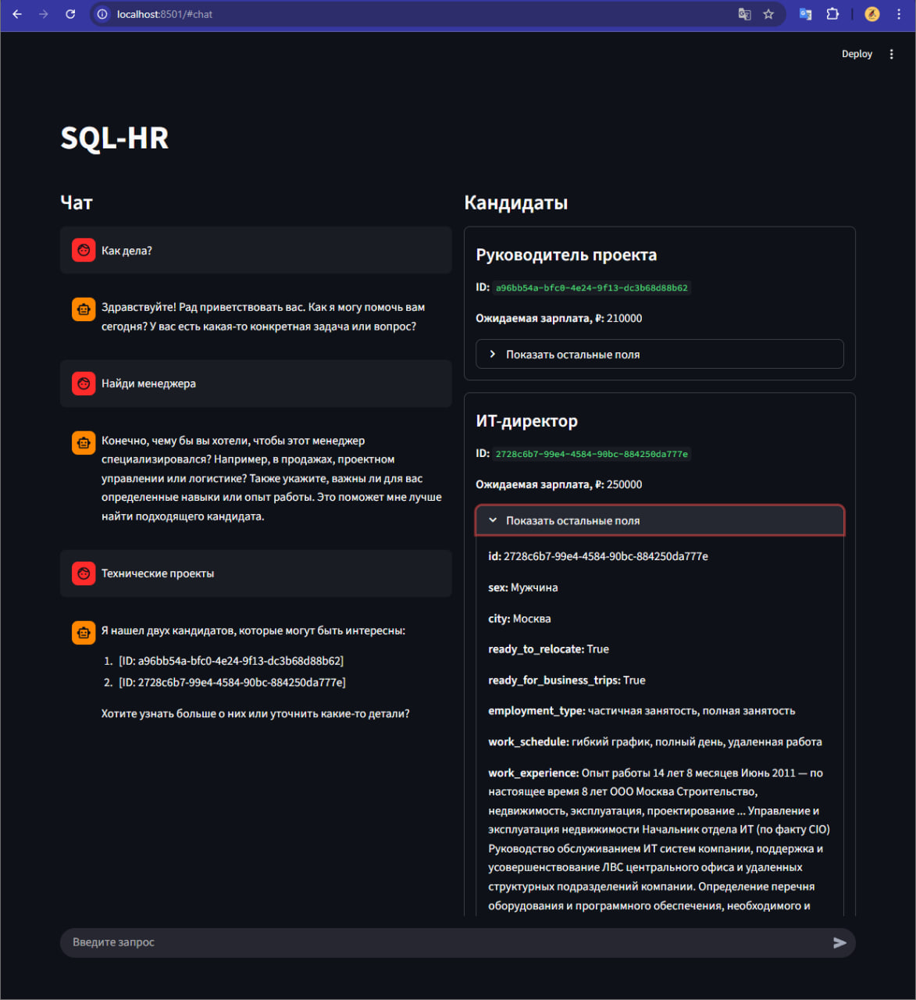

# SQL-HR

## Описание и назначение системы
SQL-HR автоматизирует отбор релевантных кандидатов по базе резюме. Система разворачивается как набор Docker‑сервисов: PostgreSQL хранит данные, `agent_server` строит пайплайн LangGraph и взаимодействует с LLM через vLLM, а результат сохраняется в `results/result.txt`. Подход позволяет итеративно уточнять поисковые акценты, дозапрашивать новых кандидатов и ранжировать их в соответствии с бизнес‑запросом. Проект изначально использует Qwen2.5‑7B‑GPTQ. Фронтенд позволяет вводить поисковую задачу, вести диалог с чат-ботом и получать итоговых кандидатов.

## Структура проекта
- `docker-compose.yml` — единая оркестрация для vLLM, `agent_server`, PostgreSQL и pgAdmin, а также проброс каталога `results/` внутрь контейнера.
- `env.example` — пример переменных окружения (доступ к БД, порты, модель LLM и ключ API).
- `agent_server/` — исходный код пайплайна (главные файлы `main.py`, `nodes.py`, `candidates.py`, `prompts.py`, `requirements.txt`, `Dockerfile`), API для фронтенда и взаимодействия с LangGraph.
- `frontend/` — Streamlit-приложение (`chat.py`) с чат-ботом, который принимает запросы пользователя, поддерживает продолжение сессии (`session_id`) и показывает найденных кандидатов.
- `example/` — скриншот `example.png` с примером работы фронтенда.
- `data/` — файлы с исходными резюме, загружается в PostgreSQL при старте.
- `db/schema.sql`, `db/add_rows.sql` — описание таблицы `candidates` и импорт исходных данных.
- `results/result.txt` — итоговый JSON со списком отобранных кандидатов (создаётся автоматически).
- `hf-cache/` — кеш Hugging Face, подключается к vLLM для повторного использования моделей.
- `.gitignore`, `Dockerfile` (в корне) и вспомогательные файлы для локальной разработки.

## Этапы отбора (по нодам LangGraph)
1. Диалог с чат-ботом (frontend) — пользователь формулирует поисковый запрос или уточнение в Streamlit UI; сообщения идут на API `agent_server`, который сохраняет `session_id` и возвращает ответы/кандидатов для карточек.
2. `node_test_db` — быстрая проверка подключения к PostgreSQL: выбирает пять записей и логирует их.
3. `node_get_task` — запрашивает у LLM текстовую постановку поиска (например, какая вакансия нужна).
4. `node_generate_accents` — формирует 1–8 тематических «акцентов» (вариантов запросов) из исходной задачи.
5. `node_choose_candidates` — для каждого акцента LLM строит первичный `QuerySpec`, по которому ORM извлекает кандидатов; затем LLM помечает наиболее подходящих.
6. `node_add_candidates` — обеспечивает целевое количество кандидатов в каждой группе: повторно создаёт уточнённые запросы, при необходимости «смягчает» фильтры и отдает LLM на повторный выбор.
7. `node_rate_candidates` — собирает все уникальные резюме, объединяет флаги `approved` и просит LLM выдать ранжированный список (есть детерминированный fallback).
8. `node_return_candidates` — сериализует результат в JSON и пытается записать его в `RESULT_FILE` (по умолчанию `results/result.txt`). Если основной путь недоступен, используется `/tmp/result.txt` внутри контейнера.
9. `node_ask_next` — задаёт пользователю вопрос для следующего уточнения и завершает текущий запуск.

## Установка и эксплуатация
1. **Зависимости.** Нужны Docker и Docker Compose. Чтобы vLLM работал, требуется GPU.
2. **Подготовка окружения.**
   ```bash
   cp env.example .env
   # отредактируйте .env: пароли БД, порт pgAdmin, модель/ключ LLM и т.д.
   ```
3. **Запуск сервисов.**
   ```bash
   docker compose up --build
   ```
   - `postgres` поднимет схему и загрузит `data/candidates.csv` через `db/*.sql`.
   - `vllm` скачает модель в `hf-cache/` и откроет API на `${VLLM_HOST_PORT}` (по умолчанию 18001).
   - `agent_server` соберёт LangGraph пайплайн и запишет результат в `results/result.txt` (также доступен внутри контейнера как `RESULT_FILE`).  
   - `pgadmin` будет доступен на `${PGADMIN_PORT}` (например, http://localhost:5050) — можно подключиться к БД и проверить данные.
